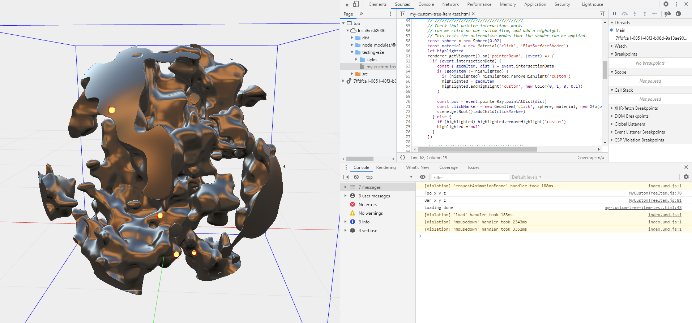

# About the MyPlugin

This project is a template for building your own plugins for Zea Engine. It comes pre-configured with the tooling to build and test plugins that extend the behavior of Zea Engine. 

The template provides the following:
 - MyCustomTreeItem: a custom class that extends the Scene Tree. 
 - MyCustomRenderPass: a custom class that extends the Renderer with pass for handling drawing custom geometry to the screen. 
 - MyCustomRenderShader: a custom shader for handling drawing custom geometry to the screen. 
 - MyCustomOperator: a custom operator for handling performing calculations in the scene tree when parameter values change. 

## Getting Started

Our recommended way to clone this template is by using [degit](https://github.com/Rich-Harris/degit), a project scaffolding tool.

1. Create your Own Repo
  - You can Fork this repo.
  - Use the 'Use this Template' button to create a new repo,
  - User [degit](https://github.com/Rich-Harris/degit) to create a project on your system.

```bash
npx degit zeainc/zea-svelte-template#main my-awesome-app
```

2. Open a shell In the folder of your new repository and install the project's dependencies by running:

```bash
npm install
```

4. Start a development server by running:

```bash
npm run dev
```

5. Use your browser to go to: http://localhost:5000/

6. Check out the tests that are available for the various plugin classes.




## Changing the Name of the Plugin

The plugin is compiled using Rollup, and so in the rollup.config.js you can see the name of the plugin as defined in the built bundle.

```javascript
  // Browser-friendly UMD build.
  {
    input: 'src/index.js',
    external,
    output: {
      name: 'myPlugin',
      file: pkg.browser,
      format: 'umd',
      sourcemap,
      globals: {
        '@zeainc/zea-engine': 'zeaEngine',
      },
    },
    plugins,
  },

```


## Testing the Plugin